# Linux
## 小知识

* 在Linux中实际上文件是没有后缀名这东西的，加后缀名只是为了便于区分。例如demo和demo.txt就可能是一样的。
* 

## 1.Linux系统结构


对每个目录的简要解释

- **/bin**：
  存放系统的基本命令（如ls、cp、mv等）的目录，所有用户均能够使用

- **/boot：**
  这里存放的是启动 Linux 时使用的一些核心文件

- **/dev ：**
  dev 是 Device(设备) 的缩写, 该目录下存放的是 Linux 的外部设备，在 Linux 中访问设备的方式和访问文件的方式是相同的。==在Linux中，万物皆文件==

- **/etc：**
  etc 是 Etcetera(等等) 的缩写,这个目录用来存放所有的系统管理所需要的配置文件和子目录。

- **/home**：
  用户的主目录，在 Linux 中，每个用户都有一个自己的目录，一般该目录名是以用户的账号命名的，如上图中的 alice、bob 和 eve。

- **/lib**：
  lib 是 Library(库) 的缩写这个目录里存放着系统的共享库和内核模块，这些库文件为可执行程序提供所需的功能

- **/media**：
  linux 系统会自动识别一些设备，例如U盘、光驱等等，当识别后，Linux 会把识别的设备挂载到这个目录下。

- **/mnt**：
  用于挂载临时文件系统，通常用于挂载其他分区或网络共享。

- **/opt**：
  opt 是 optional(可选) 的缩写，这是用于安装第三方软件的目录，通常这些软件不是通过包管理器安装的。

- **/proc**：
  proc 是 Processes(进程) 的缩写，/proc 是一种伪文件系统（也即虚拟文件系统），存储的是当前内核运行状态的一系列特殊文件，这个目录是一个虚拟的目录，它是系统内存的映射，我们可以通过直接访问这个目录来获取系统信息。
  这个目录的内容不在硬盘上而是在内存里，我们也可以直接修改里面的某些文件，比如可以通过下面的命令来屏蔽主机的ping命令，使别人无法ping你的机器：

  ```
  echo 1 > /proc/sys/net/ipv4/icmp_echo_ignore_all
  ```

- **/root**：
  该目录为系统管理员，也称作超级权限者的用户主目录。

- **/sbin**：
  s 就是 Super User 的意思，是 Superuser Binaries (超级用户的二进制文件) 的缩写，这里存放的是系统管理员使用的系统管理程序，通常只有管理员才能执行

- **/srv**：
   该目录存放一些服务启动之后需要提取的数据。

- **/sys**：

  也是一个虚拟文件系统，提供了内核的运行时信息，可用于与内核进行交互。

- **/tmp**：
  tmp 是 temporary(临时) 的缩写这个目录是用来存放一些临时文件的。

- **/usr**：
   usr 是 unix shared resources(共享资源) 的缩写，这是一个非常重要的目录，用户的很多应用程序和文件都放在这个目录下，类似于 windows 下的 program files 目录。

- **/var**：
  var 是 variable(变量) 的缩写，这个目录中存放着在不断扩充着的东西，我们习惯将那些经常被修改的目录放在这个目录下。包括各种日志文件。

- . ：代表当前的目录，也可以使用 ./ 来表示；
- .. ：代表上一层目录，也可以 ../ 来代表。

## 2.基本指令

> - **绝对路径：**
>   路径的写法，由根目录 **/** 写起，例如： /usr/share/doc 这个目录。
>   
> - **相对路径：**
>   路径的写法，不是由 **/** 写起，例如由 /usr/share/doc 要到 /usr/share/man 底下时，可以写成： **cd ../man** 这就是相对路径的写法。
>   
> - **指令选项：**
>
>   Linux的指令的选项是可以合并的，例如：ls -a然后ls -l 可以合并为ls -al 一起执行

- ls（ list files）: 列出目录及文件名
- cd（ change directory）：切换目录
- pwd（ print work directory）：显示目前的目录
- mkdir（ make directory）：创建一个新的目录
- rmdir（ remove directory）：删除一个空的目录
- cp（ copy file）: 复制文件或目录
- rm（ remove）: 删除文件或目录
- mv（ move file）: 移动文件与目录，或修改文件与目录的名称

### 2.1 pwd指令

基本语法：

~~~bash
pwd
~~~

功能：描述当前工作目录的**绝对路径**（从根目录出发）

### 2.2 ls指令

基本语法：

~~~bash
ls [选项] [目录或者文件]
~~~

| 选项       | 功能                                                         |
| ---------- | ------------------------------------------------------------ |
| -a（-all） | 显示当前目录所有的文件和目录（下列选项同理），包括以.开头的隐藏的文件和目录 |
| -A         | 同上，但不列出.（表示当前目录）以及.. 表示当前目录的父目录   |
| -l         | 以列表的形式显示信息                                         |
| -S         | 根据文件和文件夹的大小排序，从大到小                         |
| -t         | 按文件修改时间排序，最近修改的文件位于顶部                   |

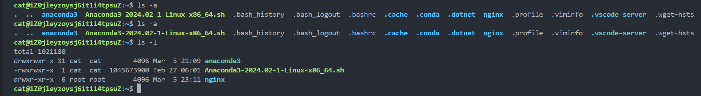

### 2.3 cd指令

基本语法：

~~~bash
cd [参数]
~~~

参数可以填相对路径和绝对路径

~~~bash
# 回到上一级目录
cd .. 
# 回到家目录-1
cd 
# 回到家目录-2
cd ~
~~~

### 2.4 mkdir指令

基本语法：

~~~bash
mkdir [选项] 要创建的目录
~~~

| 选项 | 功能         |
| ---- | ------------ |
| -p   | 创建多级目录 |
|      |              |

不加选项的mkdir指令只能创建***一个***空目录

### 2.5 rmdir指令

基本语法：

~~~bash
rmdir [选项] 要删除的空目录
~~~

rmdir 只能够删除**一个空目录**

### 2.6 touch指令

用来创建一个空文件

基本语法：

~~~bash
touch 文件名称
~~~

touch hello.txt -> 在当前目录创建一个hello.txt文件

### 2.7 cp指令

cp指令拷贝文件到指定目录

基本用法

~~~bash
# source即想要被复制的文件或文件夹
cp [选项] source targetFolder
~~~

| 选项 | 功能                                                         |
| ---- | ------------------------------------------------------------ |
| -r   | 递归复制整个文件夹（例如cp -r demo/ demo-r/，则会将整个demo文件夹拷一份到demo-r下。即demo-r文件夹下会出现一个demo文件夹） |
|      |                                                              |

当我们复制文件的时候可能会有一些同名文件的情况，在cp指令前面加上\，即\cp就能够强制覆盖不提示。

### 2.8. rm指令

基本用法：

~~~bash
rm [选项] 要删除的文件或目录
~~~

| 选项 | 功能                                       |
| ---- | ------------------------------------------ |
| -r   | 递归删除整个文件夹(删除文件夹必须带此选项) |
| -f   | 强制删除不提示                             |

### 2.9 mv指令

mv指令用于移动或重命名文件和目录

基本用法

~~~bash
# 重命名(注意好像不能够通过路径的方式描述文件然后重命名)
mv oldFileName newFileName
# 移动文件或文件夹
mv /temp/movefile /targetFolder
~~~

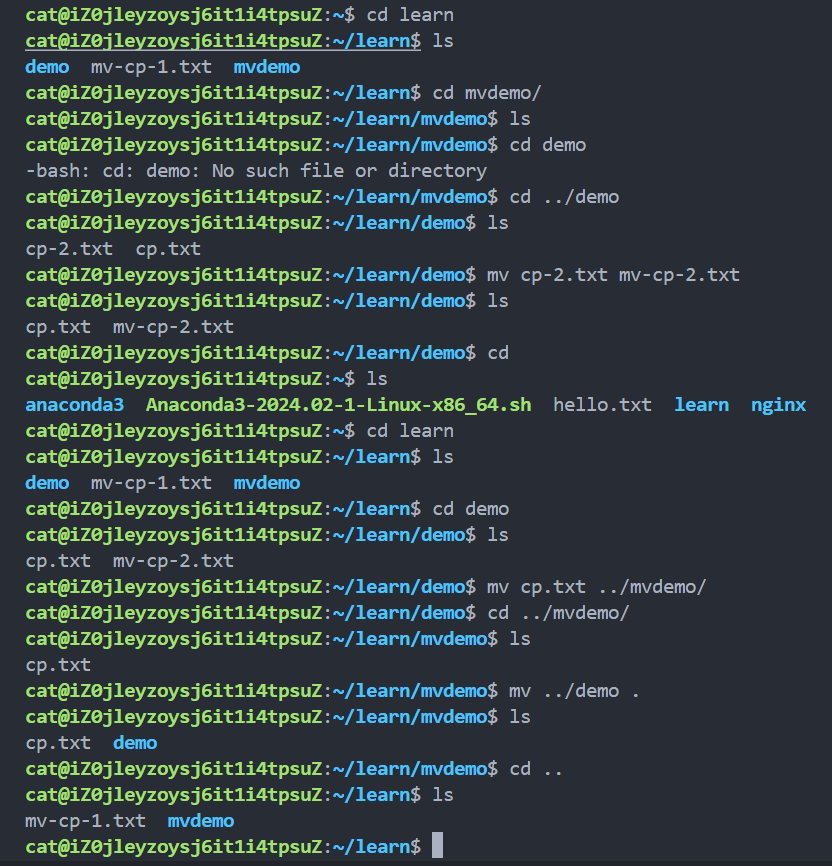

### 2.10 cat指令

cat指令查看文件内容

基本语法：

~~~bash
cat [选项] 要查看的文件
~~~

| 选项 | 功能     |
| ---- | -------- |
| -n   | 显示行号 |

实际上cat指令通常配合more或者less指令来工作

### 2.11 more指令

直接输出对应指令就行了，他会自动执行，无需清除前面看似剩下的指令或者按回车

| 操作            | 功能                               |
| --------------- | ---------------------------------- |
| 空白键（space） | 向下翻一页                         |
| Enter           | 向下翻一行                         |
| q               | 代表立刻离开more，不再显示文件内容 |
| =               | 输出当前行的行号                   |
| ：f             | 输出文件名和当前行的行号           |

### 2.12 less指令

底部会有一个：标志，代表我们可以使用下面这些操作指令

| 操作     | 功能说明                                         |
| -------- | ------------------------------------------------ |
| 空白键   | 回车向下翻一行，空格翻整个终端的大小             |
| PageDown | 向下翻一页                                       |
| PageUp   | 向上翻一页                                       |
| /字串    | 输入字串后要按下回车，按n是向下查找，按N向上查找 |
| ？字串   | 与上面的方向相反                                 |
| q        | 退出less程序                                     |

### 2.13 echo指令

输出内容到控制台

基本语法：

~~~bash
echo [选项] 输出内容
~~~

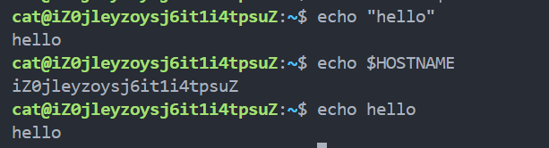

### 2.14 head指令

head指令用于显示文件的开头部分内容，默认情况下head指令显示文件的前十行内容

基本语法：

~~~bash
# 显示文件的前十行内容
head file
# 显示文件的前五行内容
head -n 5 file
~~~

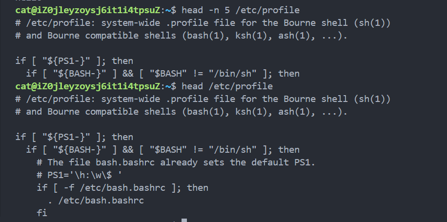

### 2.15 tail指令

tail指令用于输出文件中尾部的内容，默认情况下tail指令显示文件的最后十行内容

基本语法：

~~~bash
# 查看文件尾10行内容
tail file
# 查看文件尾n行内容
tail -n n file
# 实时追踪该文档的所有更新
tail -f file
~~~

注意了执行tail -f file 这个命令后终端会被占用！

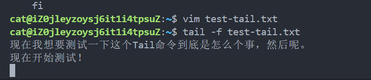

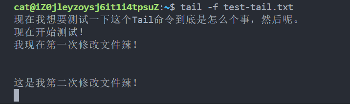

***退出方式即Ctrl + C***

### 2.16 >指令和>>指令

前一个是输出重定向覆盖，后一个是输出重定向追加

基本语法：

~~~bash
# 如果文件不存在就会新建一个
ls -l > file # 列表的内容写入到文件中（覆盖写入）
ls -al >> file # 列表的内容追加写到文件中，即写到文件末尾
cat file_1 > file_2 # 将文件1的内容覆盖到文件2（>>则为追加）
echo "内容" >> file # 向文件尾部追加。
~~~

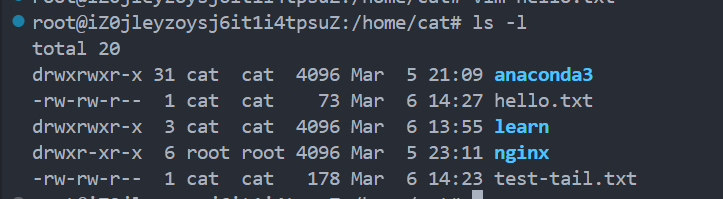

执行了ls -l > test-tail.txt 指令后

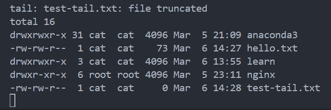

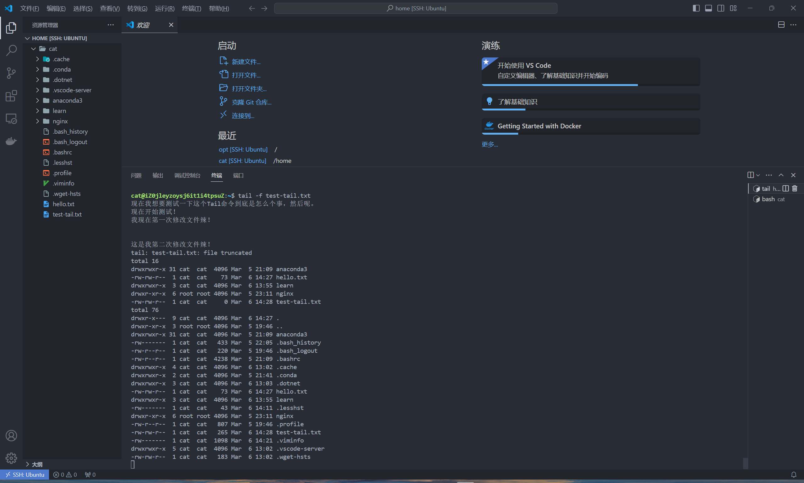

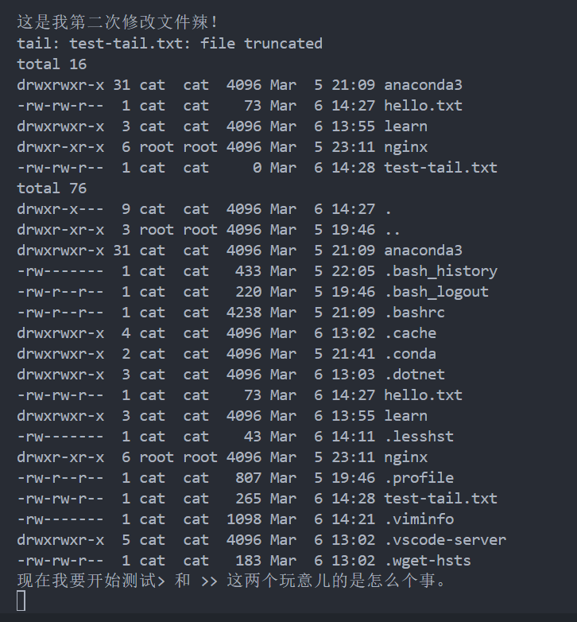

### 2.17 ln

软连接也称符号连接，类似于windows中的快捷方式，主要存放了连接其他文件的路径

基本语法：

~~~bash
# 相当于在当前目录下创建一个快捷方式
ln -s 原文件或目录 软连接名
~~~

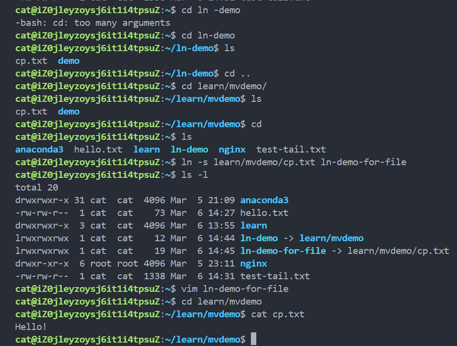

但观察pwd发现好像看到的并非是所指向的目录，这需要注意一下。

### 2.18 history指令

用于查看已经执行过的历史指令，也可以执行历史指令

基本用法：

~~~bash
# 显示最近执行的所有指令
history
# 显示最近执行的十条指令
history 10
# 执行历史编号为10的指令
!10
~~~

## 3.Linux包管理

#### 3.1 wget

==wget==命令是一个在Linux/Unix系统中用来从网络下载文件的工具。wget URL即可。这样能够直接把文件给下过来

#### 3.2 apt-get命令

apt-get是debian，ubuntu发行版的包管理工具，与红帽中的yum工具非常类似，适用于deb包管理式的操作系统，主要用于自动从互联网的软件仓库中搜索、安装、升级、卸载软件或操作系统。apt-get在安装包的时候是根据/etc/apt/sources.list文件中指定的源来寻找的安装包，你可以根据自己的需要对这个文件进行修改。

apt-get命令一般需要root权限执行，所以一般跟着sudo命令。

- sudo apt-get install package ==安装包==
- sudo apt-get install package - - reinstall 重新安装包
- sudo apt-get -f install 修复安装"-f = ——fix-missing"
- sudo apt-get remove package 删除包
- sudo apt-get remove package - - purge 删除包，包括删除配置文件等
- sudo apt-get autoremove package 删除包及其依赖的软件包
- sudo apt-get update ==更新源==
- sudo apt-get upgrade ==更新已安装的包==
- sudo apt-get dist-upgrade 升级系统
- sudo apt-get dselect-upgrade 使用 dselect 升级
- sudo apt-get build-dep package 安装相关的编译环境
- sudo apt-get source package 下载该包的源代码
- sudo apt-get clean && sudo apt-get autoclean 清理无用的包
- sudo apt-get check 检查是否有损坏的依赖

## 4.用户管理

* 新增用户

  useradd your_usr_name

  > 此方式不会自动添加home目录，在Ubuntu中需要使用adduser your_usr_name。

* 指定/修改密码

  passwd ur_usr_name

* 删除用户

  userdel ur_usr_name（不删除家目录等，完全删除可以用sudo userdel -r ur_usr_name）

* 查询用户信息

  id usr_name

* 切换用户

  在操作Linux的过程中，如果当前用户的权限不够，可以通过==su - usr_name==指令，切换到最高权限用户即root

  su - usr_name

  > 注意：
  >
  > * 从高权限用户切换到权限低的用户，不需要输入密码，反之需要
  > * 当需要返回到`原来`用户时，使用exit/logout指令

* 查看当前用户

  whoami

## 5.查找指令

### 5.1 find指令

从指定目录向下递归地遍历其各个子目录，将满足条件地文件或者目录显示在终端

***基本语法***

find [搜索范围] [选项]

> 搜索范围即写开始目录，例如 /       /home        /usr

| 选项            | 功能                                                      |
| --------------- | --------------------------------------------------------- |
| -name<查询方式> | 按照指定的文件或文件夹名查找模式去查找                    |
| -user<用户名>   | 查找属于指定用户名的所有文件或文件夹                      |
| -size<文件大小> | 按照指定的文件大小查找（注意+n为大于，-n为小于，n为等于） |

Eg1：根据文件名称查找 /home目录下的hello.txt文件。

Eg2：查找整个系统下大于200M（单位有K,M,G）的文件：find / -size +200M

### 5.2 plocate指令

locate指令可以快速定位文件路径。locate指令利用事先建立的系统中所有文件名称及路径的locate数据库实现快速定位给定的文件。Locate指令无需遍历整个文件系统，查询速度较快。为了保证查询结果的准确度，管理员必须定期更新locate时刻。

***基本语法***

locate given_file

***特别说明***

由于locate指令基于数据库进行查询，所以第一次运行前，必须使用updatedb指令创建locate数据库

Eg：

### 5.3 grep指令和管道符号 |

> grep的作用为：过滤查找。
>
> 管道符 "|"，表示将前一个命令的处理结果输出传递给后面的命令处理

***基本语法***

grep [选项] 查找内容 源文件

| 选项 | 功能               |
| ---- | ------------------ |
| -n   | 显示匹配行以及行号 |
| -i   | 忽略字母大小写     |

Eg1: cat /opt/hello.txt | grep "yes"

Eg2: grep -n "yes" /opt/hello.txt

## 6.压缩和解压

### 6.1gzip/gunzip

gzip用于压缩文件,gunzip用于解压缩文件

***基本语法***

gzip file 

gunzip file.gz

### 6.2 zip/unzip

zip用于压缩文件，unzip用于解压缩文件

### 6.3 tar指令

tar指令时打包命令，最后打包后的文件时.tar.gz格式


## 7.时间日期类

### 7.1date

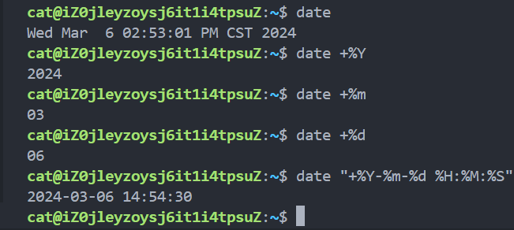

### 7.2 cal

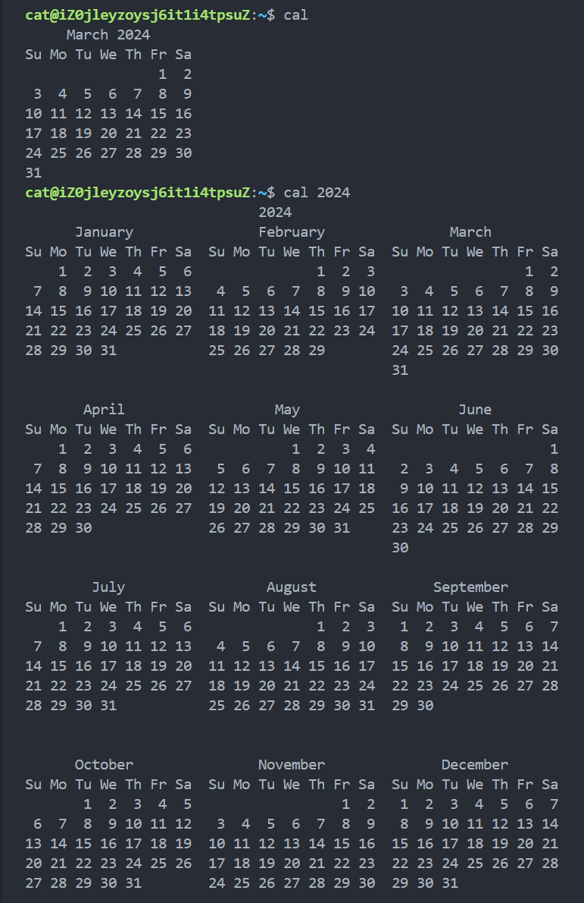

## 8. 磁盘管理

### 8.1 df

获取硬盘占用情况，以及剩余空间等信息

| 选项 | 参数                                                 |
| ---- | ---------------------------------------------------- |
| -h   | 以人们比较容易阅读的GBytes，MBytes，KBytes等格式显示 |
| -H   | 以M=1000K取代M=1024K的仅为方式                       |
| -k   | 以KBytes的容量显示各文件系统                         |
| -m   | 以MBytes的容量显示各文件系统                         |

## 9.内存管理

### 9.1 free

命令格式：

~~~bash
free [参数]
~~~

| 参数 | 功能                           |
| ---- | ------------------------------ |
| -h   | 人性化的显示系统的内存占用情况 |
| -b   | 以Byte单位显示内存使用情况     |
| -k   | 以KB单位显示内存使用情况       |
| -m   | 以MB单位显示内存使用情况       |
| -g   | 以GB单位显示内存使用情况       |
| -V   | 显示版本信息                   |
| -t   | 显示内存总和列                 |
| -s   | 持续观察内存使用情况           |

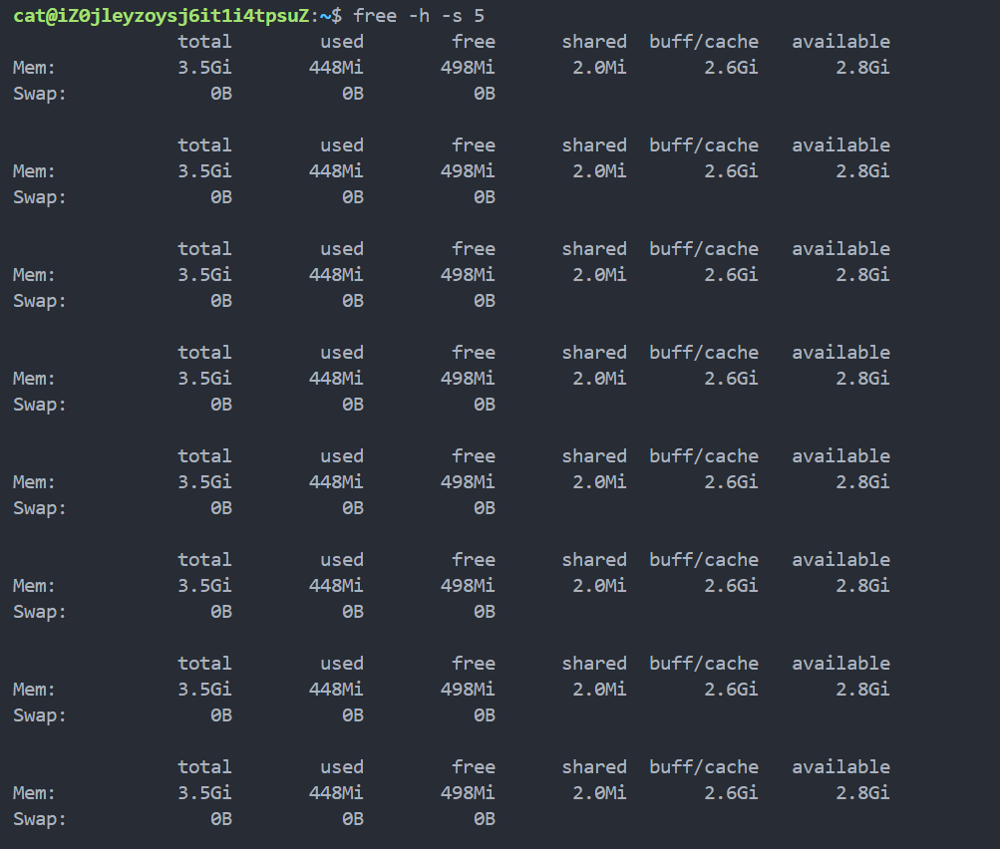

上述命令即每隔五秒查看一下内存占用情况，按下Ctrl+c即可退出

### 9.2 top

`top`命令用于实时监视系统的进程和系统资源使用情况。它提供了一个交互式界面，显示了当前正在运行的进程列表以及它们消耗的系统资源。

| 选项 | 作用                                                |
| ---- | --------------------------------------------------- |
| -c   | 显示完整的命令行而不仅仅是命令名                    |
| -d   | 设置屏幕刷新间隔，单位为秒                          |
| -p   | 显示指定进程ID（PID）的信息                         |
| -u   | 仅显示指定用户的进程                                |
| -n   | 设置top命令执行的次数后退出(不加此选项就会一直运行) |
| -i   | 不显示任何闲置或僵死进程                            |

### 9.3 ps

`ps`命令是用于显示当前运行在系统中的进程状态的命令。它可以列出与当前终端或用户相关的进程，也可以显示系统中所有进程的信息。

| 选项 | 作用                                                     |
| ---- | -------------------------------------------------------- |
| -e   | 显示系统中的所有进程                                     |
| -u   | 显示特定用户的进程                                       |
| -f   | 显示详细的进程信息                                       |
| -aux | 显示所有进程的详细信息，通常与grep命令一起使用以过滤结果 |
| -l   | 显示更多关于进程的信息                                   |

以下是`ps`命令的一些常用输出字段：

- `PID`：进程ID。
- `TTY`：控制终端。
- `TIME`：CPU时间。
- `CMD`：命令名。

`ps -aux`是一个常用的Linux命令，用于显示系统中当前运行的进程信息。

- `ps`: 表示进程状态（Process Status）。

- ```
  -aux
  ```

  : 是

  ```
  ps
  ```

  命令的选项，它有以下含义：

  - `a`: 显示所有用户的进程，而不仅仅是当前终端的进程。
  - `u`: 显示详细的进程信息，包括进程的拥有者（用户）、CPU占用率、内存占用率等。
  - `x`: 显示没有控制终端的进程。

综合起来，`ps -aux`命令会列出系统中所有进程的详细信息，包括进程的拥有者、PID（进程ID）、CPU占用率、内存占用率等。这对于了解系统的运行状态、查找特定进程以及进行系统调优非常有用。
